# 04 — PIPELINES

## Overview

This document traces every execution pipeline in the Certificate Authentication System at the level of individual source code files, functions, classes, and data transformations. Each pipeline is documented with:

- **Entry point** (file, function, route)
- **Internal processing** (step-by-step execution trace)
- **Functions/classes involved** (with line references)
- **Data transformations** (input → intermediate → output at each stage)
- **Validation** performed
- **Error handling** (exact try/except boundaries)
- **Dependencies** (internal imports and external libraries)
- **Confirmed vs. inferred behavior**

All behavior is **confirmed from repository inspection** unless explicitly marked as "Inferred".

---

## Pipeline Index

| # | Pipeline | Entry Point | Primary File |
|---|----------|-------------|-------------|
| 1 | Application Startup | `python app.py` | `app.py` |
| 2 | Certificate Issue (Web) | `POST /issue` | `app.py` lines 813-838 |
| 3 | Certificate Verify (Web) | `POST /verify` | `app.py` lines 842-864 |
| 4 | Certificate Issue (API) | `POST /api/issue` | `app.py` lines 899-912 |
| 5 | Certificate Verify (API) | `POST /api/verify` | `app.py` lines 915-928 |
| 6 | OCR Dispatch | `perform_ocr()` | `app.py` lines 369-391 |
| 7 | PDF Extraction | `_ocr_pdf()` | `app.py` lines 242-366 |
| 8 | Image OCR | `_ocr_image_file()` | `app.py` lines 206-214 |
| 9 | Image Preprocessing | `_preprocess_for_ocr()` | `app.py` lines 73-109 |
| 10 | Field Extraction | `extract_details()` | `app.py` lines 722-765 |
| 11 | Name Extraction | `_extract_name()` | `app.py` lines 443-507 |
| 12 | Course Extraction | `_extract_course()` | `app.py` lines 510-563 |
| 13 | Date Extraction | `_extract_date()` | `app.py` lines 566-603 |
| 14 | Cert ID Extraction | `_extract_cert_id()` | `app.py` lines 606-652 |
| 15 | University/Org Extraction | `_extract_university()` | `app.py` lines 655-707 |
| 16 | Year Extraction | `_extract_year()` | `app.py` lines 709-716 |
| 17 | Hash Generation | `generate_hash()` | `app.py` lines 771-781 |
| 18 | Blockchain Write | `add_certificate()` | `app.py` lines 791-797 |
| 19 | Blockchain Verify | `verify_certificate()` | `app.py` lines 800-802 |
| 20 | API Response Formatting | `_details_to_api()` | `app.py` lines 881-896 |

---

## 1. Application Startup Pipeline

### Purpose
Initialize the Flask application, configure logging, create required directories, define all helper functions, register routes, and start the development server.

### Entry Point
`python app.py` → `__name__ == "__main__"` check at line 934

### Execution Trace

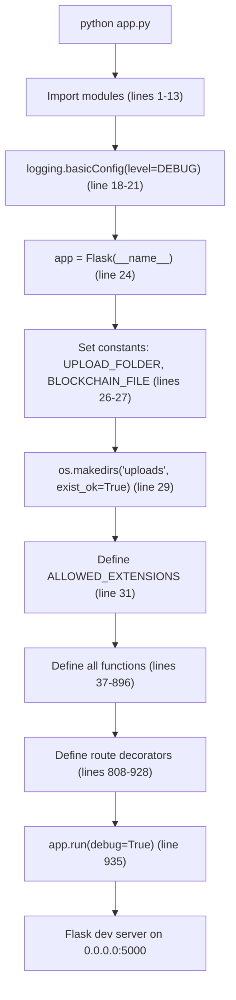

### Stage 1: Module Imports (lines 1-13)

**Confirmed from code:**

```python
from flask import Flask, render_template, request, jsonify  # line 1
import os                                                    # line 2
import hashlib                                               # line 3
import logging                                               # line 4
import re                                                    # line 5
import cv2                                                   # line 6
import numpy as np                                           # line 7
import pytesseract                                           # line 8
from PIL import Image                                        # line 9
from pdf2image import convert_from_path                      # line 10
import fitz  # PyMuPDF                                        # line 11
from werkzeug.utils import secure_filename                   # line 12
```

**Dependencies:**
- `flask`: Web framework (external)
- `cv2` (OpenCV): Image processing (external)
- `numpy`: Numerical operations (external)
- `pytesseract`: Tesseract OCR wrapper (external)
- `PIL` (Pillow): Image loading (external)
- `pdf2image`: PDF to image conversion (external)
- `fitz` (PyMuPDF): PDF text extraction (external)
- `werkzeug`: Flask utility (external)

**Note:** `fitz` (PyMuPDF) is imported at line 11, then imported again inside `_ocr_pdf()` at line 249. This is a redundant import. The inner import shadows the outer one but this has no functional impact.

### Stage 2: Logging Configuration (lines 17-22)

**Confirmed from code:**
```python
logging.basicConfig(
    level=logging.DEBUG,
    format="%(asctime)s [%(levelname)s] %(message)s",
)
logger = logging.getLogger(__name__)
```

- Level: `DEBUG` (most verbose)
- Format: `"2024-01-15 12:00:00,000 [DEBUG] message"`
- Logger name: `__name__` which resolves to `__main__` when running `app.py` directly

### Stage 3: Flask Application Creation (line 24)

```python
app = Flask(__name__)
```

- Creates a Flask application instance with the module name
- Template directory: `templates/` (default)
- Static directory: `static/` (default)

### Stage 4: Constants Definition (lines 26-31)

**Confirmed from code:**

| Constant | Value | Type | Purpose |
|----------|-------|------|---------|
| `UPLOAD_FOLDER` | `"uploads"` | `str` | Directory for uploaded certificate files |
| `BLOCKCHAIN_FILE` | `"blockchain.txt"` | `str` | File for simple hash-based blockchain |
| `ALLOWED_EXTENSIONS` | `{"pdf", "png", "jpg", "jpeg", "doc", "docx"}` | `set` | Valid file extensions for upload |
| `NOT_PROVIDED` | `"Not Provided"` | `str` | Placeholder for missing field values (defined at line 397) |

### Stage 5: Directory Creation (line 29)

```python
os.makedirs(UPLOAD_FOLDER, exist_ok=True)
```

- Creates `uploads/` directory in the project root
- `exist_ok=True` prevents `FileExistsError` if directory already exists
- **Side effect:** If the directory cannot be created (permissions, read-only filesystem), `os.makedirs` raises `PermissionError` which propagates and crashes the application

### Stage 6: Function Definitions (lines 37-896)

All functions are defined in module scope. The order of definition is:

1. `allowed_file()` (line 37)
2. `_deskew()` (line 50)
3. `_preprocess_for_ocr()` (line 73)
4. `_ocr_image_cv()` (line 112)
5. `_ocr_image_with_layout()` (line 132)
6. `_detect_name_from_layout()` (line 167)
7. `_ocr_image_file()` (line 206)
8. `_text_from_docx()` (line 217)
9. `_text_from_doc()` (line 231)
10. `_ocr_pdf()` (line 242)
11. `perform_ocr()` (line 369)
12. `_clean()` (line 400)
13. `_valid()` (line 405)
14. `_label_extract()` (line 416)
15. Extraction functions (lines 443-716)
16. `extract_details()` (line 722)
17. `generate_hash()` (line 771)
18. `load_hashes()` (line 784)
19. `add_certificate()` (line 791)
20. `verify_certificate()` (line 800)
21. Route handlers (lines 808-928)
22. `_process_upload()` (line 870)
23. `_details_to_api()` (line 881)

### Stage 7: Route Registration (lines 808-928)

Route decorators are evaluated at module load time, registering handlers with the Flask app:

| Decorator | Handler | Purpose |
|-----------|---------|---------|
| `@app.route("/")` (line 808) | `home()` (line 809) | Render index.html |
| `@app.route("/issue", methods=["GET", "POST"])` (line 813) | `issue()` (line 814) | Issue certificate |
| `@app.route("/verify", methods=["GET", "POST"])` (line 842) | `verify()` (line 843) | Verify certificate |
| `@app.route("/api/issue", methods=["POST"])` (line 899) | `api_issue()` (line 900) | API issue |
| `@app.route("/api/verify", methods=["POST"])` (line 915) | `api_verify()` (line 916) | API verify |

### Stage 8: Server Start (lines 934-935)

```python
if __name__ == "__main__":
    app.run(debug=True)
```

- `debug=True` enables:
  - Automatic reloading on code changes
  - Debugger (with PIN: 120-054-635 from log)
  - Detailed error pages
- Server listens on `127.0.0.1:5000` by default (Flask default)
- `app.run()` is blocking — the script does not proceed until the server stops

### Failure Cases

| Failure | Mechanism | Outcome |
|---------|-----------|---------|
| Missing import (e.g., ModuleNotFoundError) | Python import system | `ModuleNotFoundError` — application crashes on startup |
| Port 5000 in use | `app.run()` | `OSError: [Errno 10048]` — application crashes |
| `uploads/` creation fails | `os.makedirs()` | `PermissionError` — application crashes |
| Invalid Python version | Syntax errors | `SyntaxError` — application crashes |

---

## 2. Certificate Issue Pipeline (Web UI)

### Purpose
Accept a certificate file upload via the web interface, extract text via OCR, parse structured fields, generate a SHA-256 hash, and store the hash in the blockchain.

### Entry Point
`POST /issue` → `issue()` function at `app.py` line 814

### Mermaid Sequence Diagram

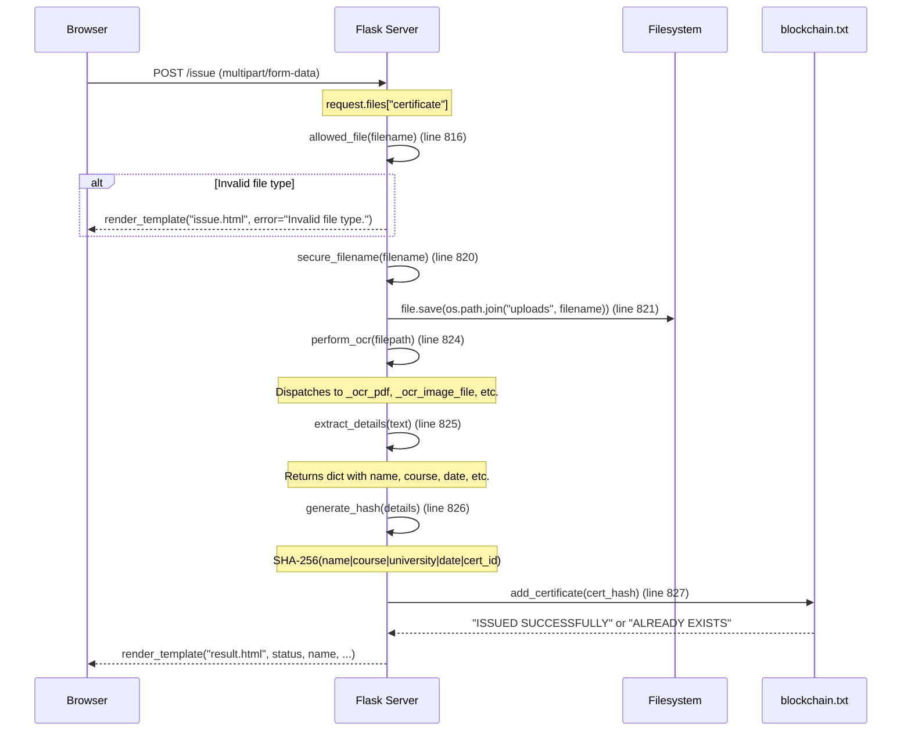

### Internal Processing (step-by-step)

**Step 1: HTTP Request Handling (line 814-816)**
```python
def issue():
    if request.method == "POST":
        file = request.files.get("certificate")
```
- `request.method` is `"POST"` (confirmed by route decorator `methods=["GET", "POST"]`)
- `request.files.get("certificate")` — Flask parses `multipart/form-data` and extracts the file field named `"certificate"`
- If no file is uploaded or the field name is wrong, `file` is `None`

**Step 2: File Validation (lines 816-817)**
```python
if not file or not allowed_file(file.filename):
    return render_template("issue.html", error="Invalid file type.")
```
- `allowed_file()` checks:
  1. `filename` is not empty (line 38)
  2. `filename` is stripped (line 40)
  3. `"."` is in filename (line 41)
  4. Extension after last `.` is in `ALLOWED_EXTENSIONS` (line 43-44)
- **Validation gap:** Only checks file extension, not file content (magic bytes)
- **Error handling:** Returns `issue.html` template with `error` variable set to "Invalid file type."

**Step 3: File Saving (lines 820-821)**
```python
filename = secure_filename(file.filename)
filepath = os.path.join(UPLOAD_FOLDER, filename)
file.save(filepath)
```
- `secure_filename()` sanitizes the filename (removes path separators, special characters)
- File saved to `uploads/<sanitized_filename>`
- **Potential issue:** If two users upload files with the same name, the second upload overwrites the first

**Step 4: OCR Processing (line 824)**
```python
text = perform_ocr(filepath)
```
- Dispatches to format-specific OCR function based on file extension
- See Pipeline 6 (OCR Dispatch) for detailed execution
- Returns raw text string (possibly empty)

**Step 5: Field Extraction (line 825)**
```python
details = extract_details(text)
```
- Extracts 7 fields: name, course, university, year, date, cert_id, full_text
- See Pipeline 10 (Field Extraction) for detailed execution
- Returns dictionary with all fields

**Step 6: Hash Generation (line 826)**
```python
cert_hash = generate_hash(details)
```
- Computes SHA-256 of concatenated fields
- See Pipeline 17 (Hash Generation) for detailed execution

**Step 7: Blockchain Write (lines 827)**
```python
status = add_certificate(cert_hash)
```
- Appends hash to `blockchain.txt` if not duplicate
- See Pipeline 18 (Blockchain Write) for detailed execution

**Step 8: Response Rendering (lines 829-837)**
```python
return render_template(
    "result.html",
    status=status,
    name=details["name"],
    course=details["course"],
    date=details["date"],
    cert_id=details["cert_id"],
    hash=cert_hash,
)
```
- Renders `result.html` template with context variables
- **Note:** `details["university"]` and `details["year"]` are NOT passed to the template

**Anomaly (confirmed from code):** The GET handler for `/issue` returns `index.html` (line 839) instead of `issue.html`:
```python
return render_template("index.html")  # line 839 — should be "issue.html"
```

### Data Transformations

| Stage | Input | Output | Transformation |
|-------|-------|--------|---------------|
| File upload | HTTP multipart form | `werkzeug.FileStorage` object | Flask request parsing |
| File validation | `FileStorage.filename` | `bool` | Extension check |
| File saving | `FileStorage`, filename | File on disk | `file.save()` |
| OCR | File path on disk | Raw text string | `perform_ocr()` |
| Extraction | Raw text string | Dict with 7 fields | `extract_details()` |
| Hashing | Dict with 7 fields | 64-char hex string | `generate_hash()` |
| Blockchain | 64-char hex string | Status string | `add_certificate()` |
| Response | Status + fields + hash | HTML string | `render_template()` |

### Files Involved

| File | Role |
|------|------|
| `app.py` (lines 813-839) | Route handler |
| `templates/issue.html` | Error display template |
| `templates/result.html` | Success display template |
| `uploads/` | File storage |
| `blockchain.txt` | Hash storage |

---

## 3. Certificate Verification Pipeline (Web UI)

### Purpose
Accept a certificate file upload, extract text via OCR, parse fields, generate hash, and check if the hash exists in the blockchain.

### Entry Point
`POST /verify` → `verify()` function at `app.py` line 843

### Execution Trace

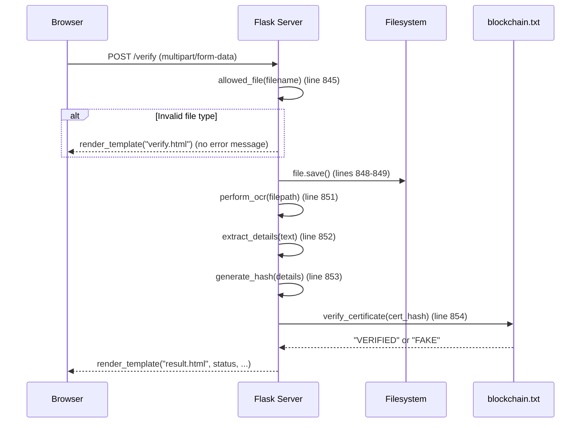

### Key Differences from Issue Pipeline

| Aspect | Issue (`/issue`) | Verify (`/verify`) |
|--------|-----------------|-------------------|
| File validation error | Shows error message in template | Shows empty verify.html (no error) |
| Blockchain operation | `add_certificate()` — append | `verify_certificate()` — lookup |
| Status messages | "ISSUED SUCCESSFULLY" / "ALREADY EXISTS" | "VERIFIED" / "FAKE" |

**Anomaly (confirmed from code):** The verify route does not pass an error message to the template when file validation fails (line 847):
```python
if not file or not allowed_file(file.filename):
    return render_template("verify.html")  # no error variable
```

---

## 4. Certificate Issue Pipeline (API)

### Entry Point
`POST /api/issue` → `api_issue()` function at `app.py` line 900

### Execution Trace

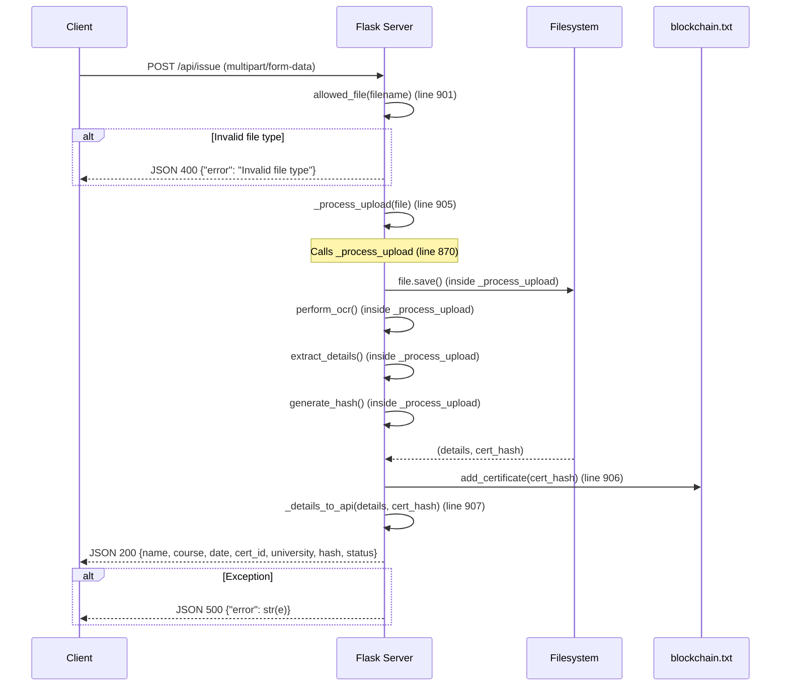

### Shared Helper: `_process_upload()` (lines 870-878)

**Confirmed from code:**
```python
def _process_upload(file):
    filename = secure_filename(file.filename)
    filepath = os.path.join(UPLOAD_FOLDER, filename)
    file.save(filepath)
    text = perform_ocr(filepath)
    details = extract_details(text)
    cert_hash = generate_hash(details)
    return details, cert_hash
```

This function is shared between `api_issue()` and `api_verify()` to avoid code duplication.

### Shared Helper: `_details_to_api()` (lines 881-896)

**Confirmed from code:**
```python
def _details_to_api(details, cert_hash):
    date_val = details.get("date", "Unknown")
    if date_val == "Unknown":
        date_val = details.get("year", "Unknown")
    cert_id = details.get("cert_id", "Unknown")
    if cert_id == "Unknown":
        cert_id = "CERT-" + cert_hash[:9].upper()
    return {
        "name": details.get("name", "Unknown"),
        "course": details.get("course", "Unknown"),
        "date": date_val,
        "cert_id": cert_id,
        "university": details.get("university", "Unknown"),
        "hash": cert_hash,
    }
```

**Key behavior:**
- If `date` is "Unknown", falls back to `year` field
- If `cert_id` is "Unknown", generates synthetic ID: `"CERT-" + first 9 chars of hash, uppercased`
- `university` is included in API response but NOT in web UI result

---

## 5. Certificate Verification Pipeline (API)

### Entry Point
`POST /api/verify` → `api_verify()` function at `app.py` line 916

### Execution Trace

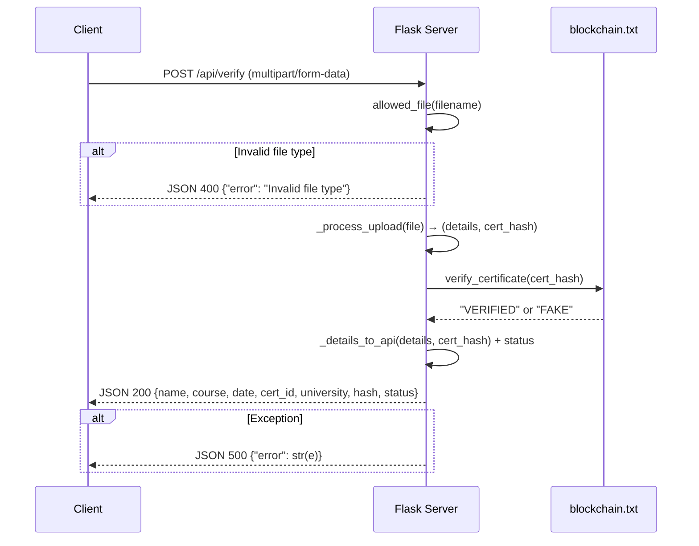

---

## 6. OCR Dispatch Pipeline

### Purpose
Route the uploaded file to the appropriate text extraction function based on its file extension.

### Entry Point
`perform_ocr(filepath)` at `app.py` line 369

### Execution Trace

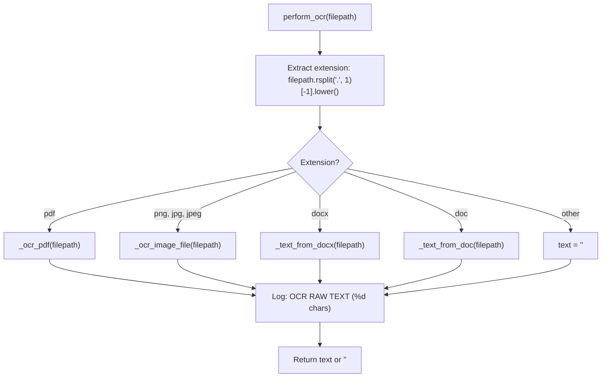

### Confirmed Code (lines 369-391)

```python
def perform_ocr(filepath: str) -> str:
    ext = filepath.rsplit(".", 1)[-1].lower() if "." in filepath else ""
    try:
        if ext == "pdf":
            text = _ocr_pdf(filepath)
        elif ext in {"png", "jpg", "jpeg"}:
            text = _ocr_image_file(filepath)
        elif ext == "docx":
            text = _text_from_docx(filepath)
        elif ext == "doc":
            text = _text_from_doc(filepath)
        else:
            text = ""
        logger.info(...)
        return text or ""
    except Exception as e:
        logger.error("OCR Error: %s", e)
        return ""
```

### Error Handling

- **Outer try/except (lines 372, 389-391):** Catches ALL exceptions from any OCR function, logs them, and returns empty string
- **Type hint:** `filepath: str` (line 369) — but no runtime validation that `filepath` is actually a string
- **Edge case:** If `filepath` has no dot (`.`), `ext` becomes `""` and text becomes `""`

### Extension → Handler Mapping

| Extension | Handler | Technology | Lines |
|-----------|---------|------------|-------|
| `pdf` | `_ocr_pdf()` | PyMuPDF + pdf2image + Tesseract | 242-366 |
| `png`, `jpg`, `jpeg` | `_ocr_image_file()` | OpenCV + Tesseract | 206-214 |
| `docx` | `_text_from_docx()` | python-docx | 217-228 |
| `doc` | `_text_from_doc()` | textract | 231-239 |

---

## 7. PDF Extraction Pipeline

### Purpose
Extract text from PDF files using a two-stage approach: first attempt digital text extraction via PyMuPDF, then fall back to high-quality OCR if insufficient text is found.

### Entry Point
`_ocr_pdf(file_path)` at `app.py` line 242

### Execution Trace

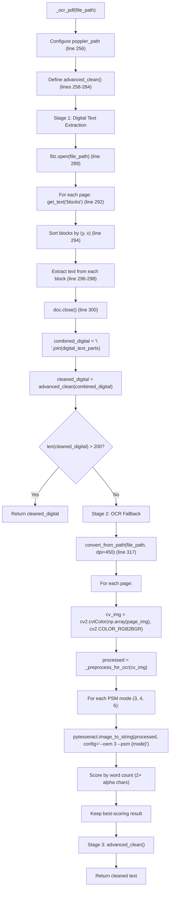

### Stage 1: Digital Text Extraction (lines 286-310)

**Confirmed from code:**
```python
digital_text_parts = []
try:
    doc = fitz.open(file_path)
    for page in doc:
        blocks = page.get_text("blocks")
        blocks.sort(key=lambda b: (b[1], b[0]))
        for b in blocks:
            block_text = b[4].strip()
            if block_text:
                digital_text_parts.append(block_text)
    doc.close()
except Exception as e:
    logger.warning(f"Digital extraction failed: {e}")
```

**Key details:**
- `get_text("blocks")` returns a list of tuples: `(x0, y0, x1, y1, text, block_no, block_type)`
- Blocks are sorted by `y` (vertical position) then `x` (horizontal position) to maintain reading order
- Only `b[4]` (the text content) is extracted
- **Threshold:** If `len(cleaned_digital) > 200` characters, digital text is considered sufficient and returned immediately (line 308)

### Stage 2: OCR Fallback (lines 313-356)

**Confirmed from code:**
```python
pages = convert_from_path(file_path, dpi=450, poppler_path=poppler_path)
for i, page_img in enumerate(pages):
    cv_img = cv2.cvtColor(np.array(page_img), cv2.COLOR_RGB2BGR)
    processed = _preprocess_for_ocr(cv_img)
    psm_modes = ["3", "4", "6"]
    best_text = ""
    max_score = -1
    for mode in psm_modes:
        config = f"--oem 3 --psm {mode}"
        try:
            raw_ocr = pytesseract.image_to_string(processed, config=config)
            words = re.findall(r'[a-zA-Z]{2,}', raw_ocr)
            score = len(words)
            if score > max_score:
                max_score = score
                best_text = raw_ocr
        except Exception as e:
            logger.debug(f"PSM {mode} failed: {e}")
    if best_text:
        ocr_results.append(best_text)
```

**Key details:**
- `dpi=450` — High resolution for maximum OCR accuracy
- Three PSM modes tried per page:
  - `--psm 3`: Fully automatic page segmentation (default)
  - `--psm 4`: Assume a single column of text of variable sizes
  - `--psm 6`: Assume a single uniform block of text
- **Scoring:** Counts words with 2+ alphabetic characters using `re.findall(r'[a-zA-Z]{2,}', raw_ocr)`
- **Poppler path:** Hardcoded to `r"C:\poppler\Library\bin\poppler-25.12.0\Library\bin"` (line 256) — Windows-specific

### Stage 3: Advanced Cleaning (lines 258-284)

**Confirmed from code:**
```python
def advanced_clean(text: str) -> str:
    # 1. Remove non-printable/garbage characters
    text = re.sub(r"[^\x20-\x7E\n]", "", text)
    # 2. Remove isolated symbols
    text = re.sub(r"(?<=^|\s)[>&%|\\/_~-](?=\s|$)", "", text)
    # 3. Collapse multiple spaces
    text = re.sub(r"[ \t]+", " ", text)
    # 4. Normalize newlines: remove empty lines, filter artifacts
    lines = [line.strip() for line in text.splitlines() if line.strip()]
    cleaned_lines = []
    for line in lines:
        if re.search(r"(?i)^Page\s+\d+(\s+of\s+\d+)?$", line):
            continue
        cleaned_lines.append(line)
    return "\n".join(cleaned_lines).strip()
```

**Note:** This cleaning is only applied within `_ocr_pdf()`. Image OCR, DOCX, and DOC paths do not apply this cleaning. This is a confirmed design choice — image OCR returns raw Tesseract output without cleaning.

### Dependency Chain (PDF Path)

```
_ocr_pdf()
├── fitz (PyMuPDF) — digital text extraction
├── pdf2image — PDF → image conversion (requires poppler)
├── _preprocess_for_ocr() — image preprocessing
│   ├── cv2 — image processing
│   └── numpy — array operations
├── pytesseract — OCR engine
└── re — text cleaning
```

### Failure Cases

| Failure | Catch | Outcome |
|---------|-------|---------|
| `fitz.open()` fails | `except Exception` (line 301) | `digital_text_parts` stays empty, proceeds to Stage 2 |
| `pdf2image` fails (poppler missing) | `except Exception` (line 355) | Returns `cleaned_digital` (may be empty) |
| Tesseract fails for a PSM mode | Inner `try/except` (line 345-347) | Continues to next PSM mode |
| All PSM modes fail | N/A | `best_text` stays empty, page skipped |
| Corrupted PDF | `fitz.open()` exception | Logged as warning, digital text empty |

---

## 8. Image OCR Pipeline

### Purpose
Extract text from image files (PNG, JPG, JPEG) using OpenCV preprocessing and Tesseract OCR.

### Entry Point
`_ocr_image_file(file_path)` at `app.py` line 206

### Execution Trace

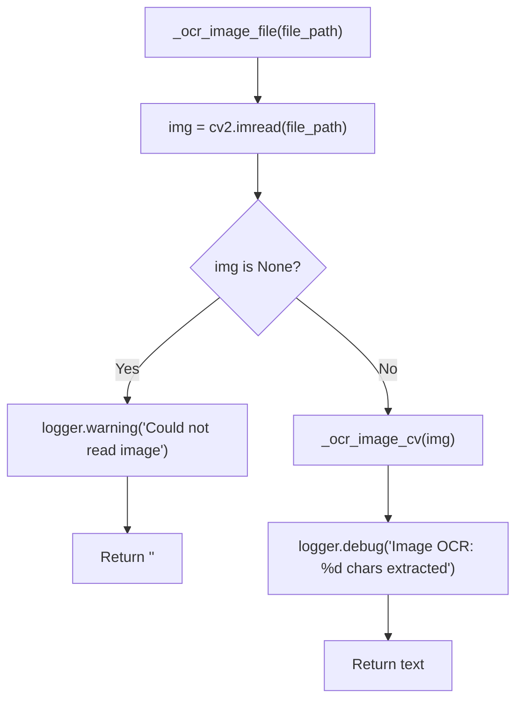

### Confirmed Code (lines 206-214)

```python
def _ocr_image_file(file_path: str) -> str:
    img = cv2.imread(file_path)
    if img is None:
        logger.warning("Could not read image: %s", file_path)
        return ""
    text = _ocr_image_cv(img)
    logger.debug("Image OCR: %d chars extracted", len(text))
    return text
```

### `_ocr_image_cv()` (lines 112-131)

```python
def _ocr_image_cv(img_cv: np.ndarray) -> str:
    processed = _preprocess_for_ocr(img_cv)
    configs = [
        "--oem 3 --psm 6",   # Single uniform block of text
        "--oem 3 --psm 4",   # Single column of text
        "--oem 3 --psm 3",   # Fully automatic page segmentation
    ]
    best = ""
    for cfg in configs:
        try:
            result = pytesseract.image_to_string(processed, config=cfg)
            if len(result.strip()) > len(best.strip()):
                best = result
        except Exception as e:
            logger.debug("Tesseract config %s failed: %s", cfg, e)
    return best
```

**Key details:**
- Three PSM modes tried: PSM 6, PSM 4, PSM 3 (different order from PDF path)
- **Scoring:** Simple string length comparison (`len(result.strip()) > len(best.strip())`)
- This is different from the PDF path which uses word-count scoring

### Pipeline Dependency

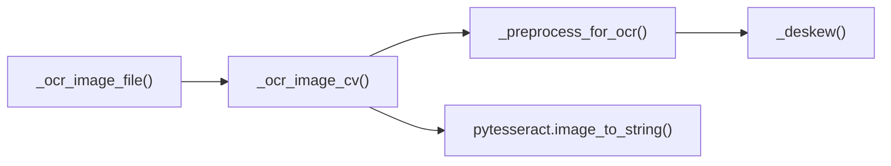

---

## 9. Image Preprocessing Pipeline

### Purpose
Apply a sequence of computer vision operations to maximize Tesseract OCR accuracy.

### Entry Point
`_preprocess_for_ocr(img_cv)` at `app.py` line 73

### Confirmed Code (lines 73-109)

```python
def _preprocess_for_ocr(img_cv: np.ndarray) -> np.ndarray:
    # 1. Upscale small images
    h, w = img_cv.shape[:2]
    if max(h, w) < 1500:
        scale = 2.0
        img_cv = cv2.resize(img_cv, None, fx=scale, fy=scale, interpolation=cv2.INTER_CUBIC)

    # 2. Grayscale
    gray = cv2.cvtColor(img_cv, cv2.COLOR_BGR2GRAY) if len(img_cv.shape) == 3 else img_cv.copy()

    # 3. Gaussian blur
    gray = cv2.GaussianBlur(gray, (3, 3), 0)

    # 4. Non-Local Means Denoising
    gray = cv2.fastNlMeansDenoising(gray, h=10, templateWindowSize=7, searchWindowSize=21)

    # 5. Deskew
    gray = _deskew(gray)

    # 6. Otsu binarization
    _, binary = cv2.threshold(gray, 0, 255, cv2.THRESH_BINARY + cv2.THRESH_OTSU)
    return binary
```

### Stage-by-Stage Breakdown

| Stage | Operation | Parameters | Condition | Effect |
|-------|-----------|-----------|-----------|--------|
| 1 | Upscale | `scale=2.0`, `INTER_CUBIC` | `max(h,w) < 1500` | Doubles image size for better character recognition |
| 2 | Grayscale | `COLOR_BGR2GRAY` | Image has 3 channels | Reduces to single channel for Tesseract |
| 3 | Gaussian Blur | Kernel `(3,3)`, `sigma=0` | Always | Smooths noise before thresholding |
| 4 | NL-Means Denoise | `h=10`, `tW=7`, `sW=21` | Always | Removes residual noise while preserving edges |
| 5 | Deskew | `minAreaRect` | Angle > 0.5° | Corrects rotation |
| 6 | Otsu Binarization | `THRESH_BINARY + THRESH_OTSU` | Always | Converts to pure black/white |

### `_deskew()` Function (lines 50-70)

```python
def _deskew(gray: np.ndarray) -> np.ndarray:
    try:
        coords = np.column_stack(np.where(gray < 128))
        if len(coords) < 50:
            return gray  # too few dark pixels to determine skew
        angle = cv2.minAreaRect(coords)[-1]
        if angle < -45:
            angle = 90 + angle
        if abs(angle) < 0.5:
            return gray  # negligible skew
        h, w = gray.shape
        M = cv2.getRotationMatrix2D((w // 2, h // 2), -angle, 1.0)
        return cv2.warpAffine(gray, M, (w, h), flags=cv2.INTER_CUBIC, borderMode=cv2.BORDER_REPLICATE)
    except Exception as e:
        logger.debug("Deskew failed: %s", e)
        return gray
```

**Key details:**
- Uses `np.where(gray < 128)` to find dark pixel coordinates (threshold 128/255)
- `cv2.minAreaRect()` finds the minimum-area rotated rectangle around these points
- The angle of this rectangle estimates the skew
- If angle < -45°, adds 90° to normalize (Tesseract's `minAreaRect` returns angles in range [-90, 0])
- Threshold 0.5°: rotations smaller than this are ignored
- **Error handling:** Full try/except — any exception returns the original image unchanged

### Otsu Binarization

`cv2.THRESH_BINARY + cv2.THRESH_OTSU` automatically determines the optimal threshold value using Otsu's method. The `0` passed as the second argument is ignored when `THRESH_OTSU` is used.

### Data Transformation

```
Input: BGR image (H x W x 3) or grayscale (H x W)
    │
    ├── Stage 1: Upscale (if needed)
    │   └── (H*2 x W*2 x 3) or (H*2 x W*2)
    │
    ├── Stage 2: Grayscale
    │   └── (H x W) — single channel uint8
    │
    ├── Stage 3: Gaussian Blur
    │   └── (H x W) — smoothed uint8
    │
    ├── Stage 4: NL-Means Denoise
    │   └── (H x W) — denoised uint8
    │
    ├── Stage 5: Deskew
    │   └── (H x W) — rotated uint8
    │
    └── Stage 6: Otsu Binarization
        └── (H x W) — binary uint8 (0 or 255)
```

---

## 10. Field Extraction Pipeline

### Purpose
Parse raw OCR text and extract structured certificate fields using multiple strategies with fallbacks.

### Entry Point
`extract_details(text)` at `app.py` line 722

### Orchestration

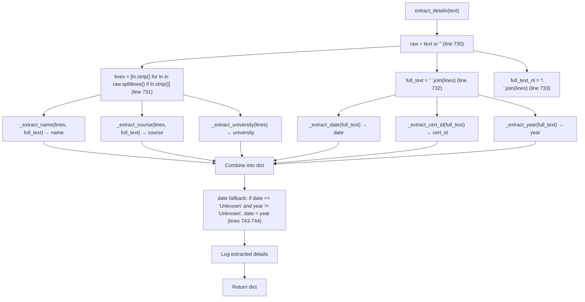

### Confirmed Code (lines 722-765)

```python
def extract_details(text: str) -> dict:
    raw = text or ""
    lines = [ln.strip() for ln in raw.splitlines() if ln.strip()]
    full_text = " ".join(lines)
    full_text_nl = "\n".join(lines)

    name       = _extract_name(lines, full_text)
    course     = _extract_course(lines, full_text)
    date       = _extract_date(full_text)
    cert_id    = _extract_cert_id(full_text)
    university = _extract_university(lines)
    year       = _extract_year(full_text)

    if date == "Unknown" and year != "Unknown":
        date = year

    return {
        "name": name,
        "course": course,
        "university": university,
        "year": year,
        "date": date,
        "cert_id": cert_id,
        "full_text": full_text_nl,
    }
```

### Helper Functions

#### `_clean()` (lines 400-402)
```python
def _clean(s: str) -> str:
    return re.sub(r"\s+", " ", (s or "").strip()).strip(" .,:;-")
```
- Collapses all whitespace (including newlines) to single space
- Strips leading/trailing punctuation: ` .,:;-`

#### `_valid()` (lines 405-413)
```python
def _valid(value: str) -> str:
    v = (value or "").strip()
    if not v or len(v) <= 1:
        return NOT_PROVIDED
    return v
```
- Returns `"Not Provided"` if value is empty, None, or single character

#### `_label_extract()` (lines 416-437)
```python
def _label_extract(lines, full_text, labels, max_words=10) -> str:
    for line in lines:
        for lbl in labels:
            pat = re.compile(re.escape(lbl) + r"\s*[:\-]?\s*(.+)", re.IGNORECASE)
            m = pat.search(line)
            if m:
                val = _clean(m.group(1))
                if val and len(val.split()) <= max_words:
                    return val
    # Also scan merged full_text (catches cross-newline labels)
    for lbl in labels:
        pat = re.compile(re.escape(lbl) + r"\s*[:\-]\s*([^\n]{2,80})", re.IGNORECASE)
        m = pat.search(full_text)
        if m:
            val = _clean(m.group(1))
            if val and len(val.split()) <= max_words:
                return val
    return ""
```
- **First pass:** Scans each line for `Label: value` patterns where `:` or `-` is optional
- **Second pass:** Scans merged `full_text` for `Label: value` patterns where `:` or `-` is required (captures up to 80 chars, no newlines)
- **Validation:** Word count ≤ `max_words`

---

## 11. Name Extraction Pipeline

### Purpose
Extract the recipient's name from the certificate text using three strategies with fallback.

### Entry Point
`_extract_name(lines, full_text)` at `app.py` line 443

### Strategy Flow

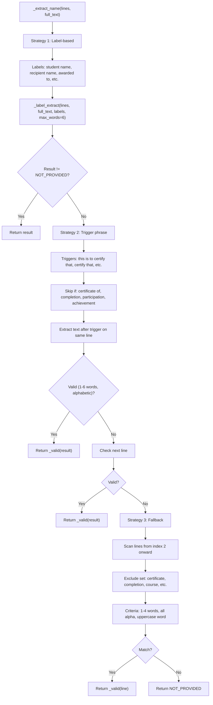

### Strategy 1: Label-Based (lines 444-454)

**Confirmed from code:**
```python
label_result = _valid(_label_extract(
    lines, full_text,
    ["student name", "recipient name", "awarded to", "presented to",
     "participant name", "candidate name", "name"],
    max_words=6,
))
if label_result != NOT_PROVIDED:
    return label_result
```

- Checks 7 label patterns (order matters — first match wins)
- Maximum 6 words for the extracted value

### Strategy 2: Trigger Phrase (lines 457-491)

**Confirmed from code:**
```python
triggers = [
    "this is to certify that", "certify that", "awarded to",
    "presented to", "this certifies that", "hereby awarded to",
    "is presented to",
]
skip_if = ["certificate of", "completion", "participation", "achievement"]
for i, line in enumerate(lines):
    low = line.lower()
    if any(sk in low for sk in skip_if):
        continue
    for trig in triggers:
        if trig in low:
            # Same-line value after the trigger
            after = _clean(line[low.find(trig) + len(trig):])
            after = re.sub(r"^(to\s+)?", "", after, flags=re.IGNORECASE).strip()
            after = re.split(r"\b(for|has|on|in|of)\b", after, maxsplit=1, flags=re.IGNORECASE)[0]
            after = _clean(after)
            if after and 1 <= len(after.split()) <= 6:
                return _valid(after)
            # Next-line fallback
            if i + 1 < len(lines):
                cand = _clean(lines[i + 1])
                words = cand.split()
                if (1 <= len(words) <= 6
                    and re.search(r"[A-Za-z]", cand)
                    and all(re.match(r"[A-Za-z'\-\.]+$", w) for w in words)):
                    return _valid(cand)
            break
```

**Key details:**
- Lines containing "certificate of", "completion", "participation", or "achievement" are skipped (likely header lines, not names)
- After extracting text after the trigger, leading "to " is stripped (e.g., "awarded to John" → "John")
- `re.split()` at boundary words (`for`, `has`, `on`, `in`, `of`) prevents capturing trailing clauses
- Next-line fallback validates: 1-6 words, contains at least one letter, all words are alphabetic (with optional apostrophes, hyphens, periods)

### Strategy 3: Fallback Heuristic (lines 494-506)

**Confirmed from code:**
```python
exclude = {
    "certificate", "completion", "course", "training", "university",
    "institute", "college", "program", "verified", "issued", "date",
    "director", "founder", "signature", "blockchain",
}
for idx in range(2, len(lines)):
    line = lines[idx]
    words = line.split()
    if 1 <= len(words) <= 4:
        if not any(ex in line.lower() for ex in exclude):
            if all(re.match(r"[A-Za-z'\-\.]+$", w) for w in words):
                if any(w[0].isupper() for w in words):
                    return _valid(line)
return NOT_PROVIDED
```

**Key details:**
- Starts scanning from index 2 (skips first 2 lines, typically headers)
- Maximum 4 words
- All words must be purely alphabetic (with `'`, `-`, `.` allowed for things like "O'Brien", "Smith-Jones", "Jr.")
- At least one word must start with an uppercase letter
- 16 exclusion words prevent matching common certificate terms

---

## 12. Course Extraction Pipeline

### Purpose
Extract the course/program name using three strategies.

### Entry Point
`_extract_course(lines, full_text)` at `app.py` line 510

### Strategy Flow

```
Strategy 1: Label-based
  Labels: "course name", "course", "program", "programme", "training",
          "module", "subject", "field of study", "degree"
  → _label_extract(lines, full_text, labels, max_words=10)

Strategy 2: Degree pattern matching
  Patterns: Bachelor/Master/Doctor of ..., B.Tech, M.Tech, B.Sc, M.Sc,
            B.E, Diploma in ..., Certificate in ...
  → Regex search on each line

Strategy 3: Trigger phrase → scan forward
  Triggers: "completed", "completion of", "successfully completed", etc.
  → Scan up to 5 lines forward for valid course name (excluding titles/roles)
```

### Strategy 2: Degree Patterns (lines 524-542)

**Confirmed from code:**
```python
degree_pats = [
    r"\bBachelor\s+of\s+[A-Za-z&\.\s]{2,60}",
    r"\bMaster\s+of\s+[A-Za-z&\.\s]{2,60}",
    r"\bDoctor\s+of\s+[A-Za-z&\.\s]{2,60}",
    r"\bB\.?\s?Tech\b[A-Za-z\s\(\)]*",
    r"\bM\.?\s?Tech\b[A-Za-z\s\(\)]*",
    r"\bB\.?\s?Sc\b[A-Za-z\s\(\)]*",
    r"\bM\.?\s?Sc\b[A-Za-z\s\(\)]*",
    r"\bB\.?\s?E\b[A-Za-z\s\(\)]*",
    r"\bDiploma\s+in\s+[A-Za-z&\.\s]{2,60}",
    r"\bCertificate\s+in\s+[A-Za-z&\.\s]{2,60}",
]
```

### Strategy 3: Trigger → Scan Forward (lines 545-561)

**Confirmed from code:**
```python
course_exclude = {"ceo", "founder", "certificate", "id", "date", "director", "signature"}
for i, line in enumerate(lines):
    low = line.lower()
    if any(sk in low for sk in skip_if):
        continue
    if any(trig in low for trig in triggers):
        for j in range(i + 1, min(i + 5, len(lines))):
            cand = _clean(lines[j])
            words = cand.split()
            if 1 <= len(words) <= 10 and not any(ex in cand.lower() for ex in course_exclude):
                return _valid(cand)
return NOT_PROVIDED
```

**Key details:**
- Scans up to 4 lines forward (i+1 to i+4)
- Excludes lines containing: ceo, founder, certificate, id, date, director, signature

---

## 13. Date Extraction Pipeline

### Purpose
Extract the issue/completion date from the certificate text using label patterns and regex.

### Entry Point
`_extract_date(full_text)` at `app.py` line 566

### Strategy Flow

```
Strategy 1: Label-based
  Labels: "date of issue", "issue date", "date of award", "awarded on",
          "issued on", "date of completion", "completion date", "date"
  → Regex "Label:\s*([^\n]{4,40})" (captures 4-40 chars, no newlines)
  → Validation: contains at least one digit

Strategy 2: Regex patterns (order matters — first match wins)
  Pattern 1: "Month DD, YYYY" (e.g., "March 4, 2026")
  Pattern 2: "DD Month YYYY" (e.g., "4 March 2026")
  Pattern 3: "DDth Month YYYY" (e.g., "4th March 2026")
  Pattern 4: "MM/DD/YYYY" or "MM-DD-YYYY" (e.g., "04/03/2026")
  Pattern 5: "YYYY-MM-DD" (e.g., "2026-03-04")
```

### Strategy 2: Date Regex Patterns (lines 581-601)

**Confirmed from code:**
```python
date_patterns = [
    # "March 4, 2026" / "March 2026"
    r"\b(?:Jan(?:uary)?|Feb(?:ruary)?|Mar(?:ch)?|Apr(?:il)?|May|Jun(?:e)?|"
    r"Jul(?:y)?|Aug(?:ust)?|Sep(?:tember)?|Oct(?:ober)?|Nov(?:ember)?|"
    r"Dec(?:ember)?)\s+\d{1,2},?\s+\d{4}\b",
    # "4 March 2026"
    r"\b\d{1,2}\s+(?:Jan(?:uary)?|...)\s+\d{4}\b",
    # "4th March 2026"
    r"\b\d{1,2}(?:st|nd|rd|th)?\s+(?:of\s+)?(?:Jan(?:uary)?|...)\s*,?\s*\d{4}\b",
    # "04/03/2026" or "2026-03-04"
    r"\b\d{1,2}[\/\-\.]\d{1,2}[\/\-\.]\d{2,4}\b",
    r"\b\d{4}[\/\-\.]\d{1,2}[\/\-\.]\d{1,2}\b",
]
```

---

## 14. Certificate ID Extraction Pipeline

### Purpose
Extract the certificate identifier using label patterns, regex patterns, and URL patterns.

### Entry Point
`_extract_cert_id(full_text)` at `app.py` line 606

### Strategy Flow

```
Strategy 1: Label-based
  Labels: "certificate no", "certificate number", "certificate id", "cert no",
          "cert id", "cert. no", "registration no", "registration number",
          "ref no", "reference no", "id no", "serial no", "enrollment no"
  → Regex "Label:\s*([A-Za-z0-9\-_\/\.]+)"
  → Validation: ≥ 3 characters

Strategy 2: Structural regex patterns
  4 patterns for alphanumeric codes:
  - AA-1234-XXXXX format
  - CERT-XXXXX format
  - AA12345 format (letters + digits)
  - AB-123456 format

Strategy 3: URL pattern extraction
  Patterns: "verify/ID", "certificate/ID", "id=ID", "cert/ID"
  → Extracts ID from verification URL
```

### Strategy 2: Structural Patterns (lines 626-635)

**Confirmed from code:**
```python
id_patterns = [
    r"\b([A-Z]{2,6}[\-\/]?\d{4}[\-\/][A-Za-z0-9\-]{3,})\b",
    r"\b(CERT[\-\.][A-Za-z0-9\-\.]{4,20})\b",
    r"\b([A-Z]{2,6}\d{5,12})\b",
    r"\b([A-Za-z]{2,4}[\-]?\d{6,})\b",
]
```

---

## 15. University/Organization Extraction Pipeline

### Purpose
Extract the issuing organization (university, institute, or company) name using keyword scoring.

### Entry Point
`_extract_university(lines)` at `app.py` line 655

### Single Strategy: Keyword Scoring (lines 673-707)

**Confirmed from code:**
```python
uni_keywords = ("university", "institute", "college", "academy",
                "school of", "department of", "faculty of")
org_keywords = ("devtown", "coursera", "udemy", "aws", "google",
                "microsoft", "ibm", "oracle", "meta", "edx")

candidates = []
for line in lines:
    clean = _clean(line)
    lower = clean.lower()
    if len(clean.split()) < 1:
        continue
    score = 0
    if any(k in lower for k in uni_keywords):    score += 5
    if any(k in lower for k in org_keywords):     score += 6
    if 2 <= len(clean.split()) <= 8:              score += 2
    if re.fullmatch(r"[A-Z\s]+", clean):          score -= 2
    if score > 0:
        candidates.append((clean, score))

if candidates:
    candidates.sort(key=lambda x: x[1], reverse=True)
    return _valid(candidates[0][0])
return NOT_PROVIDED
```

**Scoring system:**
- University keyword match: +5 points
- Organization keyword match: +6 points (higher priority)
- 2-8 word length: +2 points
- All uppercase: -2 points (penalty — likely a name, not an institution)

---

## 16. Year Extraction Pipeline

### Purpose
Extract the year from the certificate text.

### Entry Point
`_extract_year(full_text)` at `app.py` line 709

### Confirmed Code (lines 709-716)

```python
def _extract_year(full_text: str) -> str:
    years = re.findall(r"\b(19\d{2}|20\d{2})\b", full_text)
    if years:
        try:
            return str(max(int(y) for y in years))
        except Exception:
            return years[0]
    return NOT_PROVIDED
```

- Captures all 4-digit numbers starting with 19 or 20
- Returns the **maximum** year (most recent)
- Handles potential `ValueError` from `int()` conversion

---

## 17. Hash Generation Pipeline

### Purpose
Generate a deterministic SHA-256 hash from the extracted certificate fields.

### Entry Point
`generate_hash(details)` at `app.py` line 771

### Confirmed Code (lines 771-781)

```python
def generate_hash(details):
    data_string = (
        (details.get("name") or "Unknown") + "|" +
        (details.get("course") or "Unknown") + "|" +
        (details.get("university") or "Unknown") + "|" +
        (details.get("date") or "Unknown") + "|" +
        (details.get("cert_id") or "Unknown")
    )
    cert_hash = hashlib.sha256(data_string.encode()).hexdigest()
    logger.info("Generated Hash: %s", cert_hash)
    return cert_hash
```

**Key details:**
- Uses 5 fields: name, course, university, date, cert_id
- Fields are separated by pipe (`|`)
- Missing fields default to `"Unknown"` (via `or "Unknown"`)
- **No normalization** — extra spaces, different casing, etc. produce different hashes
- This is the **active hash function** used by all routes

### Comparison with Refactored Hash

| Aspect | `app.py` `generate_hash()` | `utils/cert_hash.py` `generate_cert_hash()` |
|--------|---------------------------|---------------------------------------------|
| Fields | name, course, university, date, cert_id | name, course, date, cert_id |
| Normalization | None | Whitespace collapse, lowercase |
| Missing field default | `"Unknown"` | `"Unknown"` (via `_normalize_field`) |
| Used by routes | **Yes** | **No** |

---

## 18. Blockchain Write Pipeline

### Purpose
Store a certificate hash in the blockchain, preventing duplicates.

### Entry Point (app.py)
`add_certificate(cert_hash)` at `app.py` line 791

### Confirmed Code (lines 791-797)

```python
def add_certificate(cert_hash):
    hashes = load_hashes()
    if cert_hash in hashes:
        return "ALREADY EXISTS"
    with open(BLOCKCHAIN_FILE, "a") as f:
        f.write(cert_hash + "\n")
    return "ISSUED SUCCESSFULLY"
```

### `load_hashes()` (lines 784-788)

```python
def load_hashes():
    if not os.path.exists(BLOCKCHAIN_FILE):
        return set()
    with open(BLOCKCHAIN_FILE, "r") as f:
        return set(f.read().splitlines())
```

**Key details:**
- File format: one SHA-256 hex string per line
- `splitlines()` handles all newline variants (`\n`, `\r\n`, `\r`)
- `set()` provides O(1) duplicate lookups
- **Race condition:** If two requests write simultaneously, the second read may miss the first write (no file locking)

### Comparison with `blockchain.py` Version

| Aspect | `app.py` `add_certificate()` | `blockchain.py` `Blockchain.add_block()` |
|--------|-----------------------------|------------------------------------------|
| Storage | `blockchain.txt` (plain text) | `blockchain.json` (structured JSON) |
| Block structure | None (single hash per line) | index, timestamp, data, previous_hash, hash |
| Chain validation | None | `validate_chain()` on load |
| Thread safety | None | None (single-file JSON) |

---

## 19. Blockchain Verification Pipeline

### Purpose
Check if a certificate hash exists in the blockchain.

### Entry Point (app.py)
`verify_certificate(cert_hash)` at `app.py` line 800

### Confirmed Code (lines 800-802)

```python
def verify_certificate(cert_hash):
    hashes = load_hashes()
    return "VERIFIED" if cert_hash in hashes else "FAKE"
```

**Key detail:** This is a simple set membership test — O(1) average time complexity.

---

## 20. API Response Formatting Pipeline

### Purpose
Convert the extracted details dictionary and hash into a standardized API response format.

### Entry Point
`_details_to_api(details, cert_hash)` at `app.py` line 881

### Confirmed Code (lines 881-896)

```python
def _details_to_api(details, cert_hash):
    date_val = details.get("date", "Unknown")
    if date_val == "Unknown":
        date_val = details.get("year", "Unknown")
    cert_id = details.get("cert_id", "Unknown")
    if cert_id == "Unknown":
        cert_id = "CERT-" + cert_hash[:9].upper()
    return {
        "name": details.get("name", "Unknown"),
        "course": details.get("course", "Unknown"),
        "date": date_val,
        "cert_id": cert_id,
        "university": details.get("university", "Unknown"),
        "hash": cert_hash,
    }
```

**Key transformations:**
- Date fallback: `date` → `year` if date is "Unknown"
- Synthetic cert_id: `"CERT-" + first 9 hash chars, uppercased` if cert_id is "Unknown"
- `university` is included in API response (but NOT in web UI result.html)

---

## Cross-Reference: Pipeline → File → Function

| Pipeline | File | Primary Function(s) | Line Range |
|----------|------|-------------------|------------|
| Startup | `app.py` | Module-level | 1-935 |
| Issue (Web) | `app.py` | `issue()` | 813-839 |
| Verify (Web) | `app.py` | `verify()` | 842-864 |
| Issue (API) | `app.py` | `api_issue()`, `_process_upload()` | 899-912, 870-878 |
| Verify (API) | `app.py` | `api_verify()`, `_process_upload()` | 915-928, 870-878 |
| OCR Dispatch | `app.py` | `perform_ocr()` | 369-391 |
| PDF Extraction | `app.py` | `_ocr_pdf()` | 242-366 |
| Image OCR | `app.py` | `_ocr_image_file()`, `_ocr_image_cv()` | 206-214, 112-131 |
| Image Preprocessing | `app.py` | `_preprocess_for_ocr()`, `_deskew()` | 73-109, 50-70 |
| Field Extraction | `app.py` | `extract_details()` | 722-765 |
| Name Extraction | `app.py` | `_extract_name()` | 443-507 |
| Course Extraction | `app.py` | `_extract_course()` | 510-563 |
| Date Extraction | `app.py` | `_extract_date()` | 566-603 |
| Cert ID Extraction | `app.py` | `_extract_cert_id()` | 606-652 |
| University Extraction | `app.py` | `_extract_university()` | 655-707 |
| Year Extraction | `app.py` | `_extract_year()` | 709-716 |
| Hash Generation | `app.py` | `generate_hash()` | 771-781 |
| Blockchain Write | `app.py` | `add_certificate()`, `load_hashes()` | 791-797, 784-788 |
| Blockchain Verify | `app.py` | `verify_certificate()`, `load_hashes()` | 800-802, 784-788 |
| API Response | `app.py` | `_details_to_api()` | 881-896 |

---

## Related Documents

| Document | Description |
|----------|-------------|
| [00_PROJECT_OVERVIEW.md](00_PROJECT_OVERVIEW.md) | Project overview and technology stack |
| [01_ARCHITECTURE.md](01_ARCHITECTURE.md) | System architecture and module relationships |
| [03_FILE_REFERENCE.md](03_FILE_REFERENCE.md) | Per-file reference for all important files |
| [05_API_REFERENCE.md](05_API_REFERENCE.md) | API endpoint reference |