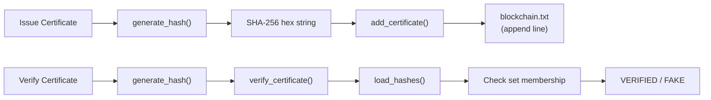

# 08 — DATA STORAGE

## Overview

This document documents all data storage mechanisms used by the Certificate Authentication System, including JSON files, blockchain storage, file uploads, temporary files, logs, and generated outputs. It also provides recommendations for future database integration.

---

## Storage Mechanisms Summary

| # | Mechanism | Type | Location | Purpose | Persistence |
|---|-----------|------|----------|---------|-------------|
| 1 | `blockchain.txt` | Plain text | Project root | Simple hash-based blockchain (app.py) | Permanent |
| 2 | `blockchain.json` | JSON file | Project root | Structured blockchain (blockchain.py) | Permanent |
| 3 | `issue_certificate.json` | JSON file | Project root | Legacy certificate storage | Legacy |
| 4 | `db.json` | JSON file | Project root | Legacy KV store | Legacy |
| 5 | `uploads/` | Directory | Project root | Uploaded certificate files | Temporary |
| 6 | `extraction_system.log` | Log file | Project root | Application log output | Runtime |
| 7 | `test_images/` | Directory | Project root | Test image fixtures | Static |
| 8 | `results/` | Directory | Project root | Output results (unused) | Unused |
| 9 | `graphify-out/` | Directory | Project root | Knowledge graph data | Development |

---

## 1. `blockchain.txt` — Simple Hash Blockchain

### Purpose
Primary blockchain storage used by `app.py` routes. Stores one SHA-256 hash per line representing issued certificates.

### Location
`c:\Projects\certificateproject\blockchain.txt`

### Format
```
a1b2c3d4e5f6...\n
b2c3d4e5f6a7...\n
c3d4e5f6a7b8...\n
```

- One 64-character hex string per line
- Lines are terminated by `\n` (Unix-style newline)
- No header, no metadata
- Append-only (new hashes are added at the end)

### Read/Write Operations

**Read (app.py lines 784-788):**
```python
def load_hashes():
    if not os.path.exists(BLOCKCHAIN_FILE):
        return set()
    with open(BLOCKCHAIN_FILE, "r") as f:
        return set(f.read().splitlines())
```

**Write (app.py lines 795-796):**
```python
with open(BLOCKCHAIN_FILE, "a") as f:
    f.write(cert_hash + "\n")
```

### Data Flow


### Characteristics
| Aspect | Detail |
|--------|--------|
| **Access Pattern** | Read all → check membership → append |
| **Concurrency** | No locking — race condition on concurrent writes |
| **Scalability** | O(n) memory for reading (all hashes loaded into memory) |
| **Integrity** | No validation — any hash can be added or removed |
| **Backup** | Simple file copy |

### Current Data
(Empty — file is created on first certificate issuance)

---

## 2. `blockchain.json` — Structured Blockchain

### Purpose
Full blockchain persistence used by `blockchain.py`. Stores a chain of blocks with index, timestamp, data, previous_hash, and hash.

### Location
`c:\Projects\certificateproject\blockchain.json`

### Format
```json
{
  "chain": [
    {
      "index": 0,
      "timestamp": "2026-03-03T12:12:52.018845Z",
      "data": "Genesis Block",
      "previous_hash": "0",
      "hash": "799b01503060bf5014efd9195747ff556a4a7adf6ec5767dfb6f269f2059bc00"
    },
    {
      "index": 1,
      "timestamp": "2026-03-03T12:18:29.780535Z",
      "data": {
        "certificate_id": "Int15762022233437",
        "name": "Jayanth",
        "course": "Intro To Python",
        "date": "10/18/2022",
        "hash": "22195dd9ba91859e7e119c68d16463b99731089457de252420ce24dd7ff28f8d"
      },
      "previous_hash": "799b01503060bf5014efd9195747ff556a4a7adf6ec5767dfb6f269f2059bc00",
      "hash": "512834999b66b6568a83805c2308262ca95bf0221d1e014bfb27f1683f49a3dd"
    }
  ],
  "updated_at": "2026-03-03T12:29:47.276326Z"
}
```

### Block Structure

| Field | Type | Description | Example |
|-------|------|-------------|---------|
| `index` | integer | Position in chain (0 = genesis) | `0` |
| `timestamp` | string | ISO 8601 UTC with "Z" suffix | `"2026-03-03T12:12:52.018845Z"` |
| `data` | any | Certificate payload or genesis string | `"Genesis Block"` or `{"certificate_id": "...", "name": "...", ...}` |
| `previous_hash` | string | SHA-256 hash of previous block | `"0"` (genesis) or hex hash |
| `hash` | string | SHA-256 hash of this block | 64-character hex string |

### Certificate Data Fields

| Field | Type | Description | Example |
|-------|------|-------------|---------|
| `certificate_id` | string | Certificate identifier | `"Int15762022233437"` |
| `name` | string | Recipient name | `"Jayanth"` |
| `course` | string | Course/program name | `"Intro To Python"` |
| `date` | string | Issue date | `"10/18/2022"` |
| `hash` | string | Certificate SHA-256 hash | `"22195dd9..."` |

### Read/Write Operations

**Read (blockchain.py lines 192-199):**
```python
def _load_chain(self) -> List[Block]:
    with open(self._path, "r", encoding="utf-8") as f:
        raw = json.load(f)
    chain_data = raw.get("chain", raw) if isinstance(raw, dict) else raw
    blocks = [Block.from_dict(b) for b in chain_data]
    if not blocks:
        return [self._create_genesis_block()]
    return blocks
```

**Write (blockchain.py lines 201-208):**
```python
def save(self) -> None:
    payload = {
        "chain": [b.to_dict() for b in self.chain],
        "updated_at": datetime.utcnow().isoformat() + "Z",
    }
    with open(self._path, "w", encoding="utf-8") as f:
        json.dump(payload, f, indent=2, ensure_ascii=False)
```

### Characteristics
| Aspect | Detail |
|--------|--------|
| **Access Pattern** | Read entire chain → validate → modify → write entire chain |
| **Concurrency** | No locking — write collision on concurrent adds |
| **Scalability** | O(n) memory — entire chain loaded into memory |
| **Integrity** | `validate_chain()` verifies hash links on load |
| **Backup** | Simple file copy |

### Current Data
- 2 blocks (1 genesis + 1 certificate)
- 1 certificate: "Jayanth" — "Intro To Python"

---

## 3. `issue_certificate.json` — Legacy Certificate Storage

### Purpose
Legacy certificate storage from an earlier version of the application. Contains a flat list of certificate records with blockchain-like structure.

### Location
`c:\Projects\certificateproject\issue_certificate.json`

### Format
```json
[
  {
    "index": 1,
    "timestamp": "2026-02-03T21:35:04.825519",
    "certificate_id": "Pyt2652022233437",
    "name": "Jayanth",
    "course": "Python Modules",
    "date": "10/18/2022",
    "hash": "1e9a0444c471fab8dbdb17dd82eb49a4195344c95bbf36e30823b97711264c21",
    "previous_hash": "0"
  }
]
```

### Current Data
4 legacy certificate records:

| Index | Name | Course | Date | Hash | Status |
|-------|------|--------|------|------|--------|
| 1 | Jayanth | Python Modules | 10/18/2022 | `1e9a0444...` | Valid |
| 2 | Jayanth | Script Introduction | 10/18/2022 | `d60da89a...` | Valid |
| 3 | Unknown | Unknown | Unknown | `dcf7785c...` | Failed extraction |
| 4 | KADARI JAYANTH | Unknown | July 30th, 2024 | `0412f4ab...` | Partial extraction |

### Migration
`blockchain.py` `_load_legacy()` (lines 140-172) automatically migrates this file to `blockchain.json` format when `blockchain.json` does not exist. The migration:
1. Reads each record
2. Converts to `Block` objects
3. Deduplicates by certificate hash
4. Chains blocks with `previous_hash` linkage
5. Saves to `blockchain.json`

---

## 4. `db.json` — Legacy KV Store

### Purpose
Simple key-value store used by `models/certificate_store.py`. Maps certificate IDs to hash values.

### Location
`c:\Projects\certificateproject\db.json`

### Format
```json
{
  "CERT-123": "a1b2c3d4e5f6...",
  "CERT-456": "b2c3d4e5f6a7..."
}
```

### Operations
```python
def load_db():      # Read entire file → dict
def save_db(db):    # Write entire dict → file
def add_certificate(cert_id, hash_value):  # Load → set → save
def verify_certificate(cert_id, hash_value):  # Load → lookup
```

### Characteristics
| Aspect | Detail |
|--------|--------|
| **Used by** | `routes/verify.py` (refactored blueprint, NOT active) |
| **Status** | Legacy — not used by the main `app.py` routes |
| **Integrity** | No validation |

---

## 5. `uploads/` — Uploaded Certificate Files

### Purpose
Runtime storage for certificate files uploaded by users during issue and verify operations.

### Location
`c:\Projects\certificateproject\uploads\`

### Creation
```python
os.makedirs(UPLOAD_FOLDER, exist_ok=True)  # app.py line 29
```

### File Storage
```python
filename = secure_filename(file.filename)          # app.py line 820
filepath = os.path.join(UPLOAD_FOLDER, filename)   # app.py line 821
file.save(filepath)                                  # app.py line 822
```

### Characteristics
| Aspect | Detail |
|--------|--------|
| **Cleanup** | No automatic cleanup — files accumulate indefinitely |
| **Overwrite** | Same filename overwrites existing file |
| **Security** | `secure_filename()` sanitizes filename |
| **Size Limit** | No upload size limit (Flask default: unlimited) |

### Subdirectory
`routes/upload.py` (lines 18-20) uses a different path:
```python
upload_folder = 'uploads/certificates'
os.makedirs(upload_folder, exist_ok=True)
filepath = os.path.join(upload_folder, filename)
```
This blueprint is not active, so this subdirectory may not exist.

---

## 6. `extraction_system.log` — Application Log

### Purpose
Contains Flask/Werkzeug debug output captured during application runtime.

### Location
`c:\Projects\certificateproject\extraction_system.log`

### Content (from inspection)
- Flask debug messages (server start, reloads)
- HTTP request logs (method, path, status code)
- Debugger PIN
- Error messages

### Size
32 lines (from inspection) — limited log history

---

## 7. `test_images/` — Test Image Fixtures

### Purpose
Directory for test certificate images used by `test_ocr.py`.

### Location
`c:\Projects\certificateproject\test_images\`

### Current Status
**Empty.** The test script checks for `test_images/sample.png` and uses hardcoded dummy text if not found:
```python
image_path = "test_images/sample.png"
if not os.path.exists(image_path):
    print("Using dummy text for extraction test.\n")
    text = """Certificate of Completion..."""
```

---

## 8. `results/` — Results Directory

### Purpose
Directory for storing output results.

### Location
`c:\Projects\certificateproject\results\`

### Current Status
**Empty.** No files are written to this directory by any current code path. It appears to be intended for future use.

---

## 9. `graphify-out/` — Knowledge Graph Data

### Purpose
Auto-generated knowledge graph data for the project, created by the Graphify development tool.

### Location
`c:\Projects\certificateproject\graphify-out\`

### Contents
| File/Directory | Purpose |
|---------------|---------|
| `graph.json` | Graph data (nodes and edges) |
| `graph.html` | Visual graph representation |
| `GRAPH_REPORT.md` | Graph summary report |
| `manifest.json` | Graph manifest |
| `cost.json` | Cost tracking |
| `.graphify_labels.json` | Label metadata |
| `.graphify_python` | Python marker |
| `.graphify_root` | Root marker |
| `cache/ast/` | AST cache files |

### Status
Development tool output. Not required for application runtime.

---

## Storage Comparison

| Aspect | `blockchain.txt` | `blockchain.json` | `db.json` |
|--------|-----------------|-------------------|-----------|
| **Used by** | `app.py` (active) | `blockchain.py` (inactive) | `models/certificate_store.py` (inactive) |
| **Format** | Plain text | JSON | JSON |
| **Structure** | Flat (hash per line) | Chain of blocks | Key-value pairs |
| **Validation** | None | Hash chain validation | None |
| **Deduplication** | Set membership | Hash lookup | Overwrite |
| **Migration** | None | From `issue_certificate.json` | None |
| **Concurrency** | Race condition | Race condition | Race condition |
| **Scalability** | O(n) memory | O(n) memory | O(n) memory |

---

## Future Database Design Recommendations

### Relational Database Schema (PostgreSQL/MySQL)

```sql
-- Certificates table
CREATE TABLE certificates (
    id SERIAL PRIMARY KEY,
    certificate_id VARCHAR(255) UNIQUE NOT NULL,
    name VARCHAR(255),
    course VARCHAR(255),
    university VARCHAR(255),
    issue_date DATE,
    year INTEGER,
    cert_hash VARCHAR(64) UNIQUE NOT NULL,
    created_at TIMESTAMP DEFAULT CURRENT_TIMESTAMP,
    updated_at TIMESTAMP DEFAULT CURRENT_TIMESTAMP
);

-- Uploaded files tracking
CREATE TABLE uploads (
    id SERIAL PRIMARY KEY,
    certificate_id INTEGER REFERENCES certificates(id),
    original_filename VARCHAR(255),
    stored_filename VARCHAR(255),
    file_size BIGINT,
    mime_type VARCHAR(100),
    file_path VARCHAR(500),
    uploaded_at TIMESTAMP DEFAULT CURRENT_TIMESTAMP
);

-- Blockchain blocks
CREATE TABLE blocks (
    id SERIAL PRIMARY KEY,
    block_index INTEGER NOT NULL,
    timestamp TIMESTAMP NOT NULL,
    certificate_id INTEGER REFERENCES certificates(id),
    previous_hash VARCHAR(64) NOT NULL,
    block_hash VARCHAR(64) UNIQUE NOT NULL,
    created_at TIMESTAMP DEFAULT CURRENT_TIMESTAMP
);
```

### Benefits of Database Migration

| Benefit | Current (File-based) | Future (Database) |
|---------|---------------------|-------------------|
| **Concurrency** | Race conditions | ACID transactions |
| **Scalability** | O(n) memory | O(log n) index lookups |
| **Querying** | None (manual grep) | SQL queries |
| **Integrity** | Manual validation | Constraints, foreign keys |
| **Backup** | File copy | Database dump, replication |
| **Access Control** | None | User roles, permissions |
| **Audit** | Manual log parsing | Audit triggers, history tables |

---

## Related Documents

| Document | Description |
|----------|-------------|
| [00_PROJECT_OVERVIEW.md](00_PROJECT_OVERVIEW.md) | Project overview |
| [01_ARCHITECTURE.md](01_ARCHITECTURE.md) | System architecture |
| [03_FILE_REFERENCE.md](03_FILE_REFERENCE.md) | Per-file reference |
| [06_CONFIGURATION.md](06_CONFIGURATION.md) | Configuration details |